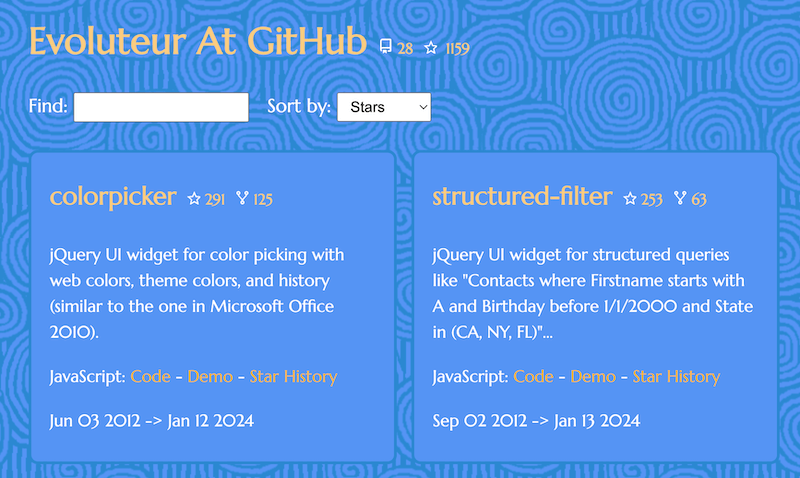

# GitHub-Project-Cards

This project is a simple web page to fetch and display GitHub projects.

Check out the [live demo](https://evoluteur.github.io/github-project-cards) and the [raw data](https://api.github.com/users/evoluteur/repos).

Just change the username (at the top of the "/js/repo.js" file) to display your projects...

For each project the card shows the project name, stars, forks, descriptions, language, creation date, and last update, as well as links to the GitHub repo, the demo, and star history.

Copyright (c) 2024 [Olivier Giulieri](https://evoluteur.github.io/).
