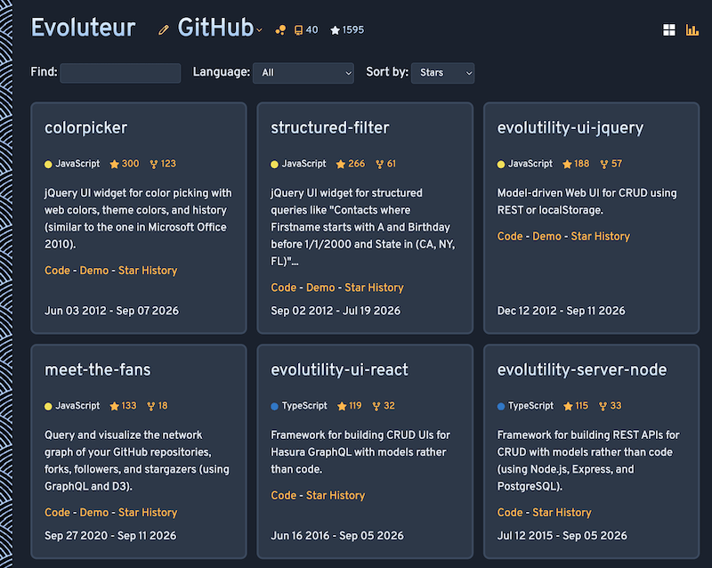
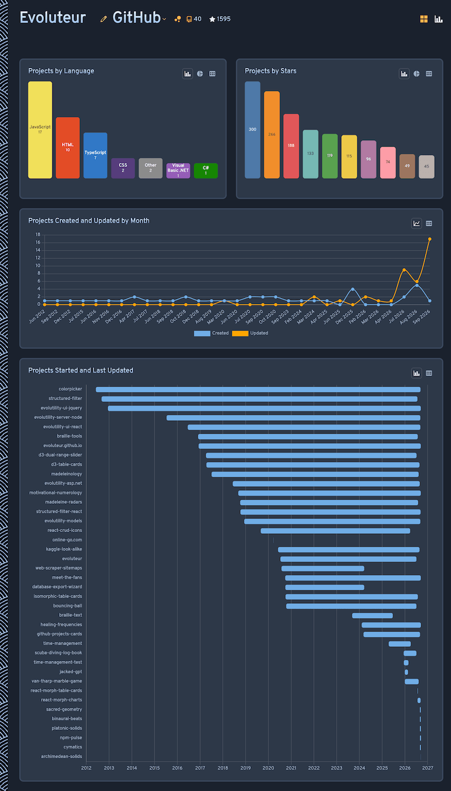

# GitHub-Projects-Cards

This project is a simple web page to fetch and display GitHub projects as cards.

Check out the [live demo](https://evoluteur.github.io/github-projects-cards) and the [raw data](https://api.github.com/users/evoluteur/repos) from [GitHub API](https://docs.github.com/en/rest).

The page displays your projects as cards with the total number of stars.

For each project the card shows the project name, stars, forks, descriptions, language, creation date, and last update, as well as links to the GitHub repo, demo, and [star history](https://www.star-history.com/#evoluteur/github-projects-cards) charts.

Check out the [charts dashboard](https://evoluteur.github.io/github-projects-cards/dashboard.html) for a look at the same repositories from further back: projects by language, by stars, created and updated by month, and a timeline of when each project was started and last updated. The total repo and star count from the cards page is repeated in the header there too.

You can change the GitHub user displayed on the page by clicking its name in the title and typing a different one, or by adding a `?user=` parameter to the page URL (e.g. `?user=torvalds`) - the same parameter works on the charts dashboard too.

You can also change the default "user" value (at the top of the [/js/repo.js](https://github.com/evoluteur/github-projects-cards/blob/main/js/repos.js) file) to display your projects instead of mine...

GitHub-Projects-Cards is Open source at [GitHub](https://github.com/evoluteur/github-projects-cards) with MIT license.

For more ways to look at your GitHub projects checkout my other project [Meet-the-Fans](https://github.com/evoluteur/meet-the-fans) ([demo](https://evoluteur.github.io/meet-the-fans/)) to query and visualize the network graph of your GitHub repositories, followers, stargazers, and forks (using [GitHub GraphQL API](https://docs.github.com/en/graphql) and [D3](https://d3js.org/)).

To see how your published packages are doing, check out [npm-Pulse](https://github.com/evoluteur/npm-pulse) ([demo](https://evoluteur.github.io/npm-pulse/)) for the downloads, weekly sparklines, and trends of all your npm packages on a single page.

Copyright (c) 2026 [Olivier Giulieri](https://evoluteur.github.io/).
